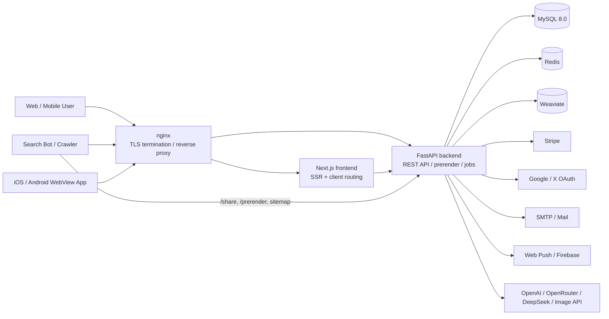
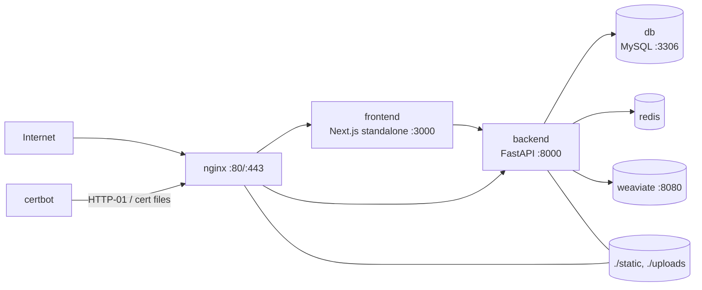

# novel-site

FastAPI + Next.js + MySQL + nginx + Docker Compose で構成した小説投稿サイトです。

## 技術スタック

- Backend: FastAPI (Python 3.12) + Uvicorn + SQLAlchemy
- Frontend: Next.js 16 + React 19
- DB: MySQL 8.0
- Cache / Rate Limit: Redis 7
- Vector Store: Weaviate
- Web / Reverse Proxy: nginx
- SSL: Let's Encrypt (certbot)
- Orchestration: Docker Compose

## 時刻の扱い

- バックエンド内部の日時は `UTC` の timezone-aware を基準に扱います。
- DB 保存時は互換性のため UTC に正規化して保存します。
- ユーザー向け表示は `JST (Asia/Tokyo)` に寄せる方針です。
- 旧実装由来で、一部 API / 管理画面にはまだ UTC 表示が残る可能性があります。日時表示を触る変更では `README.md` と `AGENTS.md` のこの方針に合わせて統一してください。

## アーキテクチャ図



## ER図

主要テーブルに絞った ER 図です。実際のスキーマは `backend/app/models.py` と `backend/app/main.py` の `ensure_*` を参照してください。

```mermaid
erDiagram
    USERS ||--o{ NOVELS : writes
    NOVELS ||--o{ EPISODES : contains
    NOVELS ||--o{ NOVEL_TRANSLATIONS : translated_to
    EPISODES ||--o{ EPISODE_TRANSLATIONS : translated_to
    EPISODES ||--o{ EPISODE_ILLUSTS : has

    USERS ||--o{ USER_FOLLOWS : follows
    USERS ||--o{ TAG_FOLLOWS : follows
    TAGS ||--o{ TAG_FOLLOWS : followed

    NOVELS ||--o{ NOVEL_TAGS : tagged
    TAGS ||--o{ NOVEL_TAGS : attached
    EPISODES ||--o{ EPISODE_TAGS : tagged
    TAGS ||--o{ EPISODE_TAGS : attached

    USERS ||--o{ NOVEL_LIKES : likes
    NOVELS ||--o{ NOVEL_LIKES : liked
    USERS ||--o{ NOVEL_FAVORITES : favorites
    NOVELS ||--o{ NOVEL_FAVORITES : favorited
    USERS ||--o{ NOVEL_COMMENTS : comments
    NOVELS ||--o{ NOVEL_COMMENTS : receives
    USERS ||--o{ EPISODE_LIKES : likes
    EPISODES ||--o{ EPISODE_LIKES : liked
    USERS ||--o{ EPISODE_COMMENTS : comments
    EPISODES ||--o{ EPISODE_COMMENTS : receives

    USERS ||--o{ SUPPORT_PLANS : owns
    USERS ||--o{ SUPPORTS : supports
    USERS ||--o{ MEMBERSHIPS : subscribes
    SUPPORT_PLANS ||--o{ MEMBERSHIPS : used_by
    MEMBERSHIPS ||--o{ MEMBERSHIP_INVOICES : billed
    USERS ||--|| AUTHOR_BALANCES : has
    USERS ||--|| AUTHORS_PAYOUT_PROFILES : configures
    USERS ||--o{ PAYOUTS : receives
    PAYOUTS ||--o{ PAYOUT_ITEMS : contains

    USERS ||--o{ AI_CHAT_CHARACTERS : owns
    AI_CHAT_CHARACTERS ||--o{ AI_CHAT_MESSAGES : has
    AI_CHAT_MESSAGES ||--o| AI_CHAT_TURN_FEEDBACK : evaluated_by
    USERS ||--o{ AI_MEMORY_ITEMS : stores
    USERS ||--o{ AI_GENERATE_LOGS : generates
    USERS ||--o{ AI_CHAT_TOKEN_USAGE_LOGS : consumes

    USERS ||--o{ DIRECT_MESSAGE_THREADS : joins
    DIRECT_MESSAGE_THREADS ||--o{ DIRECT_MESSAGES : has
    USERS ||--o{ NOTIFICATIONS : receives
    USERS ||--o{ USER_VIEW_HISTORIES : views
```



### テーブルの見方

- コンテンツ中核: `users`, `novels`, `episodes`, `tags`, `novel_tags`, `episode_tags`
- 反応 / ソーシャル: `novel_likes`, `novel_favorites`, `novel_comments`, `episode_likes`, `episode_comments`, `user_follows`, `tag_follows`, `notifications`, `direct_message_*`
- 課金 / 精算: `support_plans`, `supports`, `memberships`, `membership_invoices`, `author_balances`, `payouts`, `payout_items`, `authors_payout_profiles`
- AI / 補助: `ai_generate_logs`, `ai_novel_jobs`, `ai_novel_drafts`, `ai_chat_*`, `ai_memory_items`, `ui_i18n_*`

## API構成

現状は `backend/app/main.py` に大きめの API 実装が残りつつ、`backend/app/routers/` と `backend/app/features/` へ段階的に分割している構成です。

```mermaid
flowchart TB
    Client[Client / Frontend / Mobile]
    Nginx[nginx]
    FastAPI[FastAPI app.main]

    Client --> Nginx --> FastAPI

    FastAPI --> Auth[/Auth<br/>/api/auth/*]
    FastAPI --> Public[/Public novels / authors<br/>/api/public/*]
    FastAPI --> Novels[/Novels / Episodes / Tags / Series<br/>/api/novels/* /api/episodes/* /api/tags/* /api/series/*]
    FastAPI --> Feed[/Discovery / Feed / Search<br/>/api/feed/* /api/search/* /api/trending-tags]
    FastAPI --> Me[/Me / Dashboard / Notifications<br/>/api/me/* /api/author/dashboard*]
    FastAPI --> Social[/Comments / DM / Board / Follow]
    FastAPI --> Billing[/Stripe / Support / Membership / Payout]
    FastAPI --> AI[/AI novel / AI chat / i18n]
    FastAPI --> Admin[/Admin / Indexing / i18n jobs<br/>/api/admin/*]
    FastAPI --> Seo[/Prerender / Share / Sitemap / robots.txt]
```

### API レイヤ

- エントリポイント: `backend/app/main.py`
- ルータ集約: `backend/app/features/__init__.py`
- ルータ群: `backend/app/routers/`, `backend/app/features/*_routes.py`
- サービス層: `backend/app/services/`, `backend/app/features/*_service.py`
- リポジトリ層: `backend/app/repositories/`
- モデル / スキーマ: `backend/app/models.py`, `backend/app/schemas.py`

### 主な API 群

- 認証 / OAuth / 2FA: `/api/auth/*`
- 公開小説 / 作者 / 検索: `/api/public/*`, `/api/search/*`
- 小説 / エピソード / タグ / シリーズ: `/api/novels/*`, `/api/episodes/*`, `/api/tags/*`, `/api/series/*`
- フィード / レコメンド / トレンド: `/api/feed/*`, `/api/trending-tags`
- コメント / DM / 掲示板: `/api/dms*`, `/api/board/*`, 各 `comments` エンドポイント
- 支援 / Stripe / 振込: `/api/supports/*`, `/api/memberships/*`, `/api/stripe/*`, `/api/authors/me/*`
- AI 小説 / AI チャット / 翻訳: `/api/ai/*`, `/api/i18n/*`
- 管理 / SEO / indexing: `/api/admin/*`, `/sitemap*.xml`, `/robots.txt`, `/share/*`, `/prerender/*`

## インフラ構成

`docker-compose.yml` ベースの常用構成です。



### 配信経路

- `nginx` が HTTPS 終端とリバースプロキシを担当
- 通常の画面遷移は `frontend` の Next.js へ転送
- `/api/*` は `backend` の FastAPI へ転送
- `/share/*`, `/sitemap*.xml`, `/robots.txt`, bot 向け `/prerender/*` も `backend` が返却
- `/static/*`, `/uploads/*` は nginx からボリュームを直接配信

### コンテナの役割

- `db`: MySQL 本体。永続化は `db-data`
- `backend`: FastAPI, バッチ起動, Prisma ではなく SQLAlchemy + 手動 `ensure_*`
- `frontend`: Next.js standalone サーバー
- `redis`: レート制限や一部キャッシュの保存先。未使用時はプロセス内メモリへフォールバック可能
- `weaviate`: AI チャットメモリや特徴量検索用のベクトルストア
- `nginx`: TLS, ルーティング, 静的配信
- `certbot`: 証明書更新用

## 主な機能（現状）

- 認証
  - ユーザー登録 / ログイン
  - パスワードリセット（メール）
  - OAuth ログイン（Google / X）
  - ログインコード検証（`/api/auth/login/start`, `/api/auth/login/verify`）
- 小説
  - 作成 / 編集 / 削除
  - 公開 / 下書き
  - タグ、年齢区分（`all/r15/r18`）、創作区分（`original/fanfic`）
  - 公開ランキング、公開プロフィール連携
- エピソード
  - 作成 / 編集 / 削除
  - 公開 / 下書き
  - カバー画像・挿絵アップロード
  - 共有ページ（`/share/episodes/{id}`）
- コミュニティ
  - 小説/エピソードのコメント
  - 小説/エピソードのいいね
  - 小説のお気に入り（favorite）
  - DM（スレッド + メッセージ）
  - 通知センター（未読数 API 含む）
- 作者向け
  - 作品分析（analytics）
  - 支援プラン管理
  - 残高表示 / 振込プロフィール設定
- 支援/課金
  - Stripe Checkout（単発支援 / 月額支援）
  - Stripe webhook 連携
- AI
  - 小説生成・続き生成
  - タイトル候補 / タグ候補 / 要約候補
  - 生成ジョブ管理（ユーザー/管理者）
  - AI 利用ログ
  - AIチャット:
    - 自動会話モード（停止ボタン + チャットで「停止」「止める」停止）
    - ゲスト会話のログイン時移行（JSONバックアップ自動保存）
    - 同名キャラの複製作成 + インデックス表示（`#1`, `#2`）
    - キャラ削除は論理削除（`is_deleted`）
- 管理
  - 管理者ログイン
  - ユーザー管理
  - 問い合わせ管理
  - 支払プレビュー / 支払生成 / ステータス更新
  - Indexing URL 送信、`/sitemap.xml`

## ディレクトリ構成（抜粋）

- `backend/` FastAPI アプリ
- `frontend/` Next.js アプリ
- `nginx/` nginx 設定・証明書関連
- `static/episode_images/` エピソード画像
- `docker-compose.yml` 本番想定構成
- `docker-compose.free.yml` ローカル検証用構成

## ローカル開発

前提: Docker / Docker Compose がインストール済み

初回は用途に応じて次のどちらかを `.env` にコピーし、各シークレット値を埋めてください。

- ローカル開発: `.env.development.example`
- 本番用の最小構成: `.env.production.example`

`.env.example` はローカル開発向けの互換テンプレートです。

```bash
git clone <your-repo-url>
cd novel-site
docker compose up --build
# または
# docker compose -f docker-compose.free.yml up --build
```

フロント変更後は Next.js の再ビルドが必要です。

```bash
cd frontend
npm install
npm run build
cd ..
docker compose up --build -d frontend nginx
```

## Backend / Frontend 単体起動

Backend:

```bash
cd backend
uvicorn app.main:app --reload --host 0.0.0.0 --port 8000
```

Frontend:

```bash
cd frontend
npm install
npm run dev
```

## 主要環境変数（抜粋）

- DB: `MYSQL_DATABASE`, `MYSQL_USER`, `MYSQL_PASSWORD`, `MYSQL_ROOT_PASSWORD`
- Auth/JWT: `JWT_SECRET_KEY`
- OAuth: `GOOGLE_OAUTH_CLIENT_ID`, `GOOGLE_OAUTH_CLIENT_SECRET`, `X_OAUTH_CONSUMER_KEY`, `X_OAUTH_CONSUMER_SECRET`
- OAuth URL: `FRONTEND_ORIGIN`, `BACKEND_ORIGIN`
- Stripe: `STRIPE_SECRET_KEY`, `STRIPE_WEBHOOK_SECRET`, `STRIPE_PRICE_ID`
- Admin: `ADMIN_USERNAME`, `ADMIN_PASSWORD_HASH`, `ADMIN_JWT_SECRET`
- Mail: `SMTP_HOST`, `SMTP_PORT`, `SMTP_USER`, `SMTP_PASS`, `SMTP_FROM`
- Push: `WEBPUSH_VAPID_PUBLIC_KEY`, `WEBPUSH_VAPID_PRIVATE_KEY`, `WEBPUSH_VAPID_SUBJECT`
- AI: `OPENAI_API_KEY`, `OPENAI_MODEL_TEXT`, `OPENROUTER_API_KEY`, `DEEPSEEK_API_KEY`
- SEO/IndexNow: `INDEXNOW_ENABLED`, `INDEXNOW_KEY`, `INDEXNOW_HOST`, `INDEXNOW_ENDPOINT`

## 翻訳仕様（2026-05）

- 小説翻訳の実行モードは `docker-compose.yml` の以下フラグで切り替える。
  - `NOVEL_TRANSLATION_ORIGINAL_ONLY`
  - `NOVEL_TRANSLATION_JA_EN_ONLY`
  - `NOVEL_TRANSLATION_ALL_LANGUAGES`
- フラグは排他的に使う想定。複数 `1` の場合は `ORIGINAL_ONLY > JA_EN_ONLY > ALL_LANGUAGES` の順で優先する。
- 現在の既定値は原語のみ。
  - `NOVEL_TRANSLATION_ORIGINAL_ONLY=1`
  - `NOVEL_TRANSLATION_JA_EN_ONLY=0`
  - `NOVEL_TRANSLATION_ALL_LANGUAGES=0`
- 翻訳は作者がプレミアム会員のときだけ実行する。
  - 通常の保存時同期翻訳
  - バックグラウンド翻訳
  - 日次翻訳ボット
  - 公開カード表示を契機にした翻訳キュー投入
  のすべてで同一条件を使う。
- 非プレミアム時は「翻訳しない」だけで、翻訳完了扱いにはしない。
  - 作者があとからプレミアム化した場合、過去作品も未翻訳のまま残る。
  - そのため、日次翻訳ボットや作品の再保存経由で過去作品も翻訳対象に戻る。
- 翻訳で使ったAIトークン数は `AI利用履歴` に記録する。
  - 小説翻訳は `小説翻訳 N#... ja->en` のような要約で保存する。
  - エピソード翻訳は `エピソード翻訳 E#... ja->en` のような要約で保存する。
  - 分割翻訳などで複数回AI呼び出しが発生した場合も、1件の翻訳ごとに合算して記録する。

## マイページ AI モデル既定値（2026-05）

- マイページの AI モデル設定の既定値は `google/gemini-2.5-flash`。
- 対象項目:
  - `ai_summary_model`
  - `ai_title_model`
  - `ai_tag_model`
  - `ai_story_agent_model`
  - `ai_comment_revision_model`
- 2026-05 時点の全ユーザー確認では、保存済み設定に `Gemini 2.5` または `Gemini 3` 以外の値は存在しない。

## 運用・開発時の注意点

- マイグレーションツール未導入:
  - `backend/app/main.py` の `ensure_*` で不足カラムを補完する設計。
  - schema/model 変更時は `ALTER TABLE` 等の手動DDLが必要。
- API 実装は `backend/app/main.py` に集約:
  - `backend/app/routers/*.py` は一部旧実装が残るため、修正箇所を誤らない。
- AIチャットの同名キャラ運用:
  - 同名は別IDで作成できる（上書きしない）。
  - APIレスポンスに `is_name_duplicate`, `name_duplicate_index` を含み、UIで識別表示する。
- AIチャットの削除/学習:
  - キャラ削除は `ai_chat_characters` の論理削除（`is_deleted`, `deleted_at`）。
  - 学習キー（`character_profile_key`）は同名キャラ間で継続される仕様（キャラ名 + speech_gender ベース）。
- 公開状態は互換対応が混在:
  - `status` と `is_public` を併用する箇所があるため、公開ロジック変更時は一覧/詳細/権限を横断確認する。
- フロント成果物:
  - `frontend/dist` は編集せず `frontend/src` を編集し再ビルドする。
- 機密情報管理:
  - `.env` や証明書ファイルの取り扱いに注意（本番鍵は安全な保管先で管理）。

## API 防御強化メモ（2026-05）

- 優先順:
  - `POST /api/admin/auth/login`
  - `/api/admin/*` の状態変更系
  - `POST /api/contact/messages`
  - `POST /api/auth/login/start` と `POST /api/auth/register/email/start`
  - `/api/ai/chat*` と画像生成系
- 2026-05 時点で導入済み:
  - 管理者ログイン失敗制限: 既定 `15分で5回`
  - 管理系状態変更 API の CSRF 防御: `admin_csrf_token` Cookie と `X-CSRF-Token` ヘッダ照合
  - 公開問い合わせ: ゲスト送信時 reCAPTCHA、既定 `15分で5回`、短時間重複投稿抑止
  - 登録メール送信: `email + IP` 単位で既定 `15分で5回`、再送クールダウン `60秒`
  - ログイン開始: `username + IP` 単位で失敗既定 `15分で5回`、2FA コード再送クールダウン `60秒`
  - AI チャット系: テキスト `user 20回/分`, `guest 8回/分`
  - AI 画像生成: `user 5回/5分`, `guest 2回/5分`
- 補足:
  - 保存先は Redis 優先、未使用時はプロセス内メモリへフォールバック。
  - 制限値は環境変数で上書きできる。変更時は README か AGENTS の運用メモも更新する。

## 現状の開発要点（2026-03 時点）

- フィードAPIのログイン要件:
  - `GET /api/feed/new` はゲスト利用可（新着順）。
  - `GET /api/feed/trending` はゲスト利用可（急上昇）。
  - `GET /api/feed/recommended` はゲスト利用可。未ログイン時は公開おすすめロジックへフォールバック。
  - 期限切れ/不正トークンが来ても、上記3APIは `401` ではなくゲスト扱いにフォールバックする実装。
- ホーム画面表示方針:
  - ホーム（`sort=new` かつ検索条件なし）では、ログイン有無に関わらず「おすすめ」「急上昇作品」を表示。
  - 「フォロー中の新着」「フォロー中タグの新着」はセクション自体は表示し、未ログイン時は案内文を表示。
- 管理画面の Google Indexing:
  - 繰越キューは送信時に最優先。
  - 未登録優先は Search Console 検査結果（`inspect=1`）を使ってフロント側で並び替える。
- AIチャット背景画像:
  - キャラ画像がある場合、背景は `position: fixed` で表示され、スクロールしても維持。

## 反映手順（重要）

- `docker compose build backend` だけでは、実行中コンテナには反映されません。
- バックエンド反映は以下を実施:

```bash
docker compose up --build -d backend
```

- フロント反映は以下を実施:

```bash
cd frontend
npm run build
cd ..
docker compose restart nginx
```

## テスト

- 自動テストは最小限です。
- 現状の実行可能テスト:

```bash
cd frontend
npm test
```

必要に応じて API の手動確認手順をPRや作業メモに記載してください。

## `main.py` 縮小の自動化

- `backend/app/main.py` の router 分割作業は既存の抽出/生成スクリプトで半自動化されています。
- 一括実行は `scripts/auto_refactor_main_py.sh` を使います。既定で `timeout 5h` を内包し、5時間で停止します。
- 実行後は `scripts/verify_main_py_shrink.py` が `main.py` 行数、残存 `@app` ルート数、変更ファイル範囲を自動確認します。
- 既存の dirty worktree があっても、実行前の `git status` を baseline として除外して判定します。

```bash
cd /home/ubuntu/novel-site
bash scripts/auto_refactor_main_py.sh
```

- レポート出力先:
  - `reports/auto_refactor_main_py/before.json`
  - `reports/auto_refactor_main_py/summary.json`
- 実行対象:
  - `refactor_state.json` の `router_files` に登録済み
  - かつ `completed_groups` に未登録
  - かつ `main.py` にまだ `@app.*` ルートが残っている group
- 既定で変更を許可する範囲:
  - `backend/app/main.py`
  - `backend/app/routers/`
  - `refactor_state.json`
  - `reports/`
  - `scripts/`

個別確認だけ行う場合:

```bash
python3 scripts/extract_routes.py --output reports/router_before.json
# refactor 実行
python3 scripts/extract_routes.py --output reports/router_after.json
python3 scripts/verify_main_py_shrink.py \
  reports/router_before.json \
  reports/router_after.json \
  --require-decrease \
  --allowed-path backend/app/main.py \
  --allowed-path backend/app/routers/ \
  --allowed-path refactor_state.json \
  --allowed-path reports/ \
  --allowed-path scripts/
```

## SEO / インデックス運用

- `docs/seo_indexing_ops.md` を参照してください。
